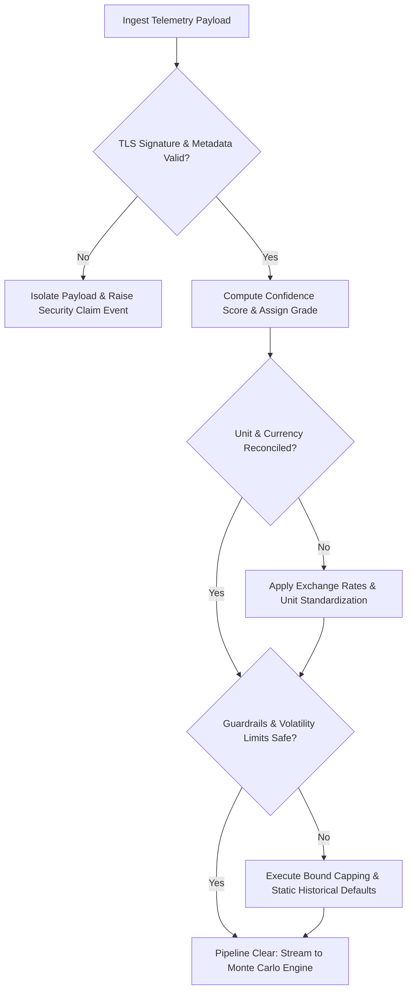

# Technical Architecture: Dedicated Autonomous Simulation & Deterministic Triage Agent

This document defines the comprehensive specifications, mathematical algorithms, and execution workflows for the **Dedicated Autonomous Simulation & Deterministic Triage Agent** of Kaza X Labs. 

This agent is engineered as a sandboxed, high-throughput autonomous operator. Its objective is to ingest broad-spectrum infrastructure telemetry, execute a strict three-tier triage process, and perform large-scale Monte Carlo stress testing to generate risk-adjusted financial projections.

---

## 1. System Topology & Component Layout

```mermaid
graph TD
    subgraph Data Ingestion Layer [Web-Scale Data Collection]
        API[Cloud Retail APIs: AWS, GCP, Azure]
        Scrape[Puppeteer / Playwright headful proxy scraper]
        Macro[Macroeconomic & SaaS Indexes]
        Client[Stripe & Client Telemetry Ingest]
    end

    subgraph Triage Layer [Three-Tier Triage Pipeline]
        T1[Tier 1: TLS & Signature Verification / Grading]
        T2[Tier 2: Mathematical Reconciliation & Unit Normalizer]
        T3[Tier 3: Guardrail Enforcement & Boundary Fallbacks]
    end

    subgraph Simulation Layer [Monte Carlo NPV Engine]
        Gen[10,000 Permutations Generator]
        NPV[Net Present Value Math Array]
        Risk[Risk-Adjusted Confidence Intervals]
    end

    subgraph Output Layer [Steering Interface]
        LLM[Gemini 2.5 Strategic Planning Operator]
        UI[Interactive YoY Dashboard UI]
    end

    API & Scrape & Macro & Client --> T1
    T1 --> T2
    T2 --> T3
    T3 --> Gen
    Gen --> NPV
    NPV --> Risk
    Risk --> LLM
    LLM --> UI

    style Data Ingestion Layer fill:#0f172a,stroke:#3b82f6,stroke-width:2px
    style Triage Layer fill:#1e1b4b,stroke:#8b5cf6,stroke-width:2px
    style Simulation Layer fill:#022c22,stroke:#10b981,stroke-width:2px
    style Output Layer fill:#1c1917,stroke:#f59e0b,stroke-width:2px
```

---

## 2. Ingestion & Cryptographic Lineage Verification

To ensure data integrity, all external telemetry is parsed through a strict **Lineage Gateway**:

1. **Ingestion Sources & Quebec Industry Adapters**:
   * **AWS Price List Query API & GCP Cloud Billing API**: Direct programmatic hooks for base cloud infrastructure calculations.
   * **Quebec Retail & Restaurant POS Adaptors**: Ingestion connectors for localized point-of-sale systems (Lightspeed POS, TouchBistro) and integration with Revenu Québec's **MEV/SRM (Module d'enregistrement des ventes)** tax reporting data.
   * **Industrial & Factory IoT Systems**: Scraping and API telemetry for manufacturing stacks, including Siemens/Honeywell PLCs and warehouse ERP software (SAP, Epicor, Microsoft Dynamics 365).
   * **Construction & Contracting Compliance Gateways**: Adapters tracking CCQ (Commission de la construction du Québec) collective agreement wage indexes and project tracking data (Procore, Joist).
   * **Municipal & Public Sector Scrapers**: Specialized Playwright scrapers targeting municipal portals and the Quebec public procurement system (**SEAO - Système électronique d'appel d'offres**) for active tender requirements.
   * **Playwright Scraping Pool**: Runs in a sandboxed headful browser, routing traffic through a pool of residential proxies with 1.5s - 4.0s random request jitter to bypass Cloudflare and Akamai barriers when pulling raw vendor pricing directories.
2. **Cryptographic Validation**:
   * All scraped payloads are verified against public TLS root certificates.
   * A `SHA-256` checksum hash is instantly computed over the raw ingested telemetry array and cached locally with an absolute TTL of 6 hours to prevent replay attacks and ensure math tracing:
     $$\text{LineageHash} = \text{SHA256}(\text{TelemetryPayload} \mathbin{\Vert} \text{Timestamp})$$

---

## 3. The Three-Tier Triage & Fallback Algorithm

All incoming records must traverse the three-tier validation pipeline. The workflow algorithm and its fallbacks are specified below:

### Ingestion Data Processing Workflow

### Architectural Error Handling & Fallback Specifications

| Incident / Scenario | System Severity | Instant Action Protocol (Immediate Action) | Mathematical Fallback Strategy |
| :--- | :--- | :--- | :--- |
| **TLS Signature Failure / Payload Tampering** | `CRITICAL_SECURITY` | Isolate payload. Revoke API session tokens. Log Security Audit failure inside `/security_claims` collection. | Halt execution. Reject data entirely. |
| **SaaS/Cloud Schema Mismatch** | `WARNING_COMPLIANCE` | Flag structural warning. Divert payload to dynamic regression normalizer. | Map missing parameters to standard historical metrics based on node categories. |
| **Macro Volatility Threshold Exceeded (>25% shift)** | `SRE_THRESHOLD` | Lock current strategic plan. Freeze dynamic variable updates. Send alert notifications. | Lock macro indicators (e.g. $r = 8\%$) and fallback to cryptographically verified historical baseline pricing matrices. |
| **Scraper Proxy Block (Rate Limit / Jitter Timeout)** | `NON_FATAL_INFRA` | Rotate proxy ports. Implement exponential backoff ($2^n \times 1000\text{ms}$). | Read from the local `EXTERNAL_MARKET_CACHE` index fallback. |

---

## 4. The 10,000-Pass Monte Carlo NPV Simulation Engine

To transition to true deterministic decision-making under uncertainty, the projection engine runs **10,000 distinct stress-test permutations** for each selected system component.

### A. Parameter Perturbation Variables
For each run $i$ (where $1 \le i \le 10,000$), the engine perturbs key variables using randomized heavy-tailed Student-t distributions to simulate tail-risk and Black Swan pricing shocks:

1. **Macroeconomic Cost of Capital ($r_i$)**:
   $$r_i \sim t_{\nu=3}(\mu = 0.08, \sigma = 0.015)$$
2. **Tech Growth / Compute Demand Scaler ($g_i$)**:
   $$g_i \sim t_{\nu=3}(\mu = 0.15, \sigma = 0.03)$$
3. **Cloud Inflation index ($inf_i$)**:
   $$inf_i \sim t_{\nu=3}(\mu = 0.04, \sigma = 0.008)$$
4. **Bespoke Inefficiency Surcharge Coefficient ($c_i$)**:
   $$c_i \sim t_{\nu=3}(\mu = 1.0, \sigma = 0.12)$$

### B. Projections and Financial NPV Formulations
For each simulation $i$ and year $t \in [1, 5]$:
$$\text{CostWithoutRebuild}_{i,t} = \text{ReconciledCost} \times 12 \times \prod_{k=1}^{t-1} (1 + g_i + inf_i)$$
$$\text{CostWithRebuild}_{i,t} = (\text{ReconciledCost} \times (1 - \text{EfficiencyGain})) \times 12 \times \prod_{k=1}^{t-1} (1 + (g_i \times 0.6) + inf_i)$$

The Net Present Value ($\text{NPV}_i$) for simulation $i$ is calculated as:
$$\text{NPV}_i = \sum_{t=1}^5 \frac{\text{CostWithoutRebuild}_{i,t} - \text{CostWithRebuild}_{i,t} - (\text{MaintenanceSurcharge} \times c_i)}{(1 + r_i)^t} - \text{InitialInvestment}$$

### C. Statistics Synthesis & Risk Intervals
After 10,000 runs, the engine computes:
* **True Mathematical Average NPV**:
   $$\mu_{\text{NPV}} = \frac{1}{10,000} \sum_{i=1}^{10,000} \text{NPV}_i$$
* **Standard Deviation**:
   $$\sigma_{\text{NPV}} = \sqrt{\frac{1}{10,000} \sum_{i=1}^{10,000} (\text{NPV}_i - \mu_{\text{NPV}})^2}$$
* **Value-at-Risk (VaR) 95% Confidence Bound (Black Swan Margin)**:
   $$\text{VaR}_{95} = \mu_{\text{NPV}} - 1.645 \times \sigma_{\text{NPV}}$$
   *(Under heavy-tailed Student-t modeling, this represents the worst-case economic return under severe system and market disruption, serving as the strict baseline for our planning approval.)*

---

## 5. Strategic Steering & Operator Interface

The calculated statistical outputs ($\mu_{\text{NPV}}$, $\text{VaR}_{95}$, true average ROI) are piped directly into the **Strategic Planning Operator** prompt. 

The LLM is strictly prohibited from altering these numbers. It reviews the statistical intervals and the architectural topology, synthesizes a qualitative, non-probabilistic recommendation, and formats the output for the interactive frontend dashboard.
